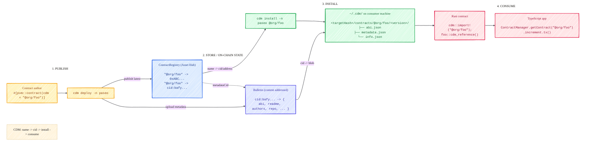
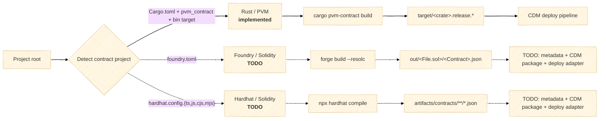
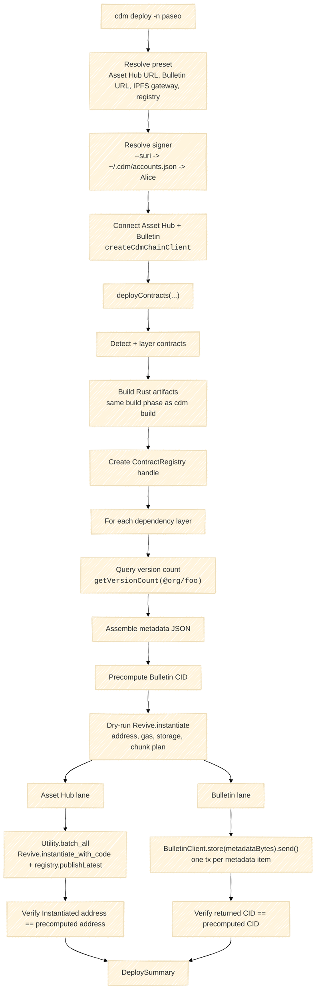
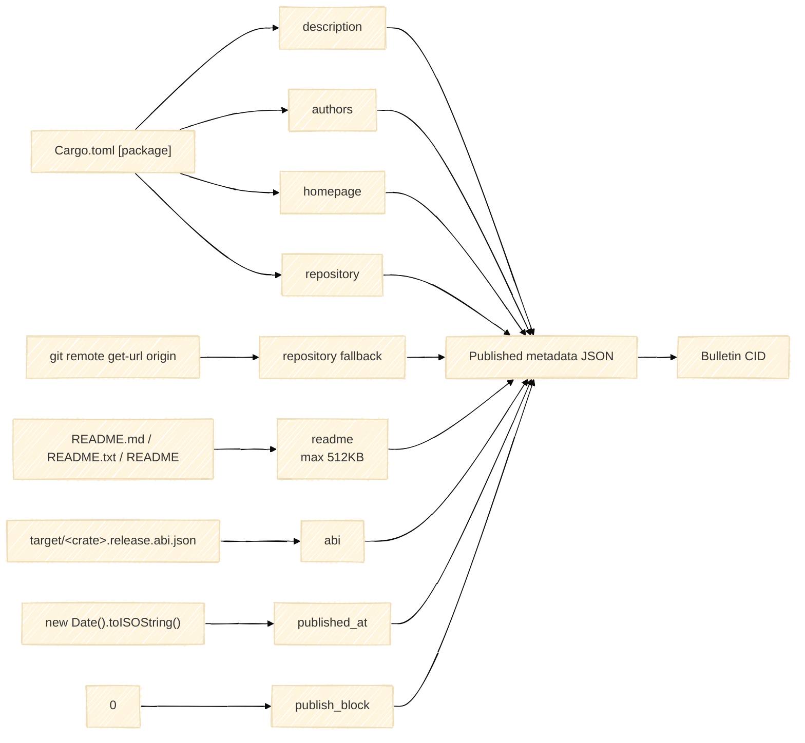
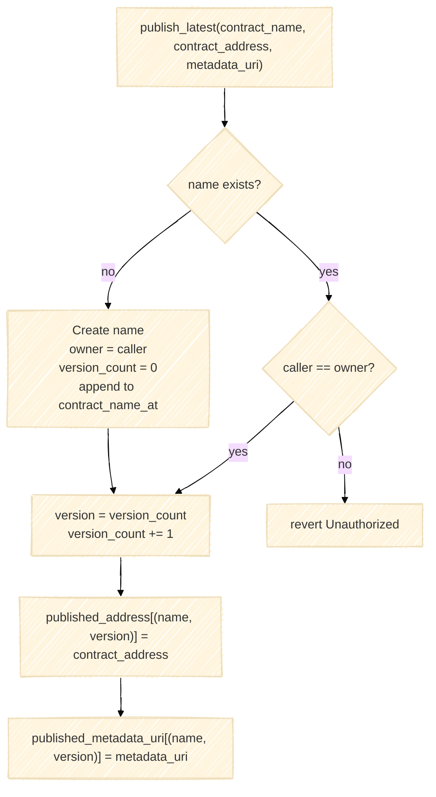
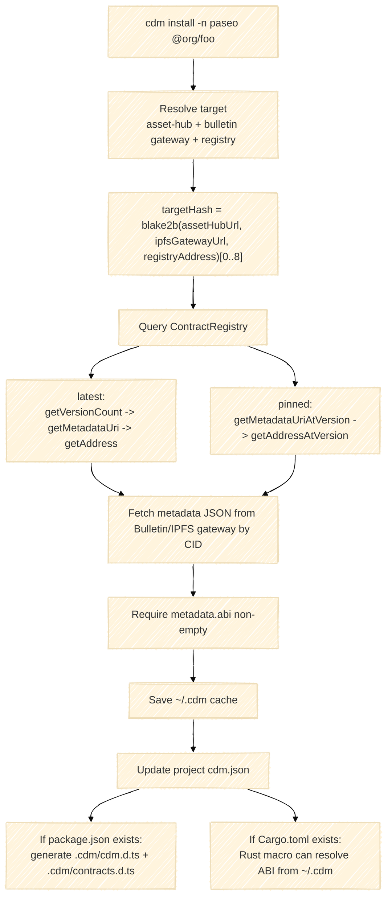
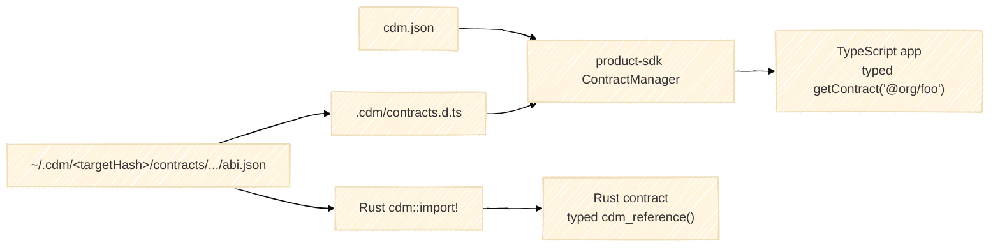
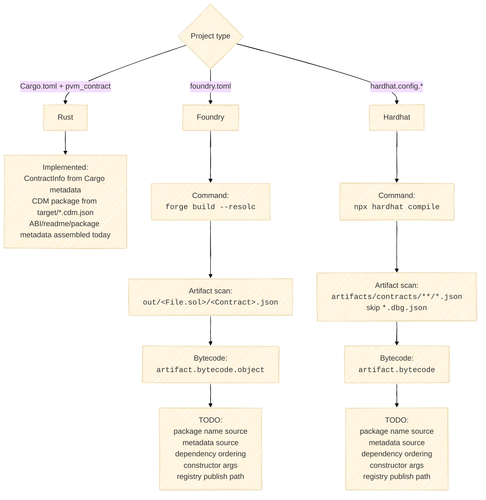

# CDM System

Status:

- Rust/PVM contracts: implemented end-to-end.
- Foundry Solidity contracts: build artifact shape known; CDM deploy/publish/register path TODO.
- Hardhat Solidity contracts: build artifact shape known; CDM deploy/publish/register path TODO.

## System Map



## Language Entry Points



## CLI Pipeline: `cdm build`

```mermaid
%%{init: {"theme": "base", "look": "handDrawn", "flowchart": {"curve": "basis"}}}%%
flowchart TD
    cmd["cdm build<br/><code>src/apps/cli/src/commands/build.ts</code>"]
    opts["Resolve options<br/>root, contracts filter, features, registryAddress"]
    detect["detectDeploymentOrderLayered(root)<br/><code>cargo metadata --no-deps</code>"]
    graph["Build dependency layers<br/>same-layer crates build concurrently"]
    build["pvmContractBuildAsync(crate)<br/><code>cargo pvm-contract build --manifest-path &lt;root&gt;/Cargo.toml -p &lt;crate&gt;</code>"]
    env["Env:<br/><code>CONTRACTS_REGISTRY_ADDR=&lt;registryAddress&gt;</code>"]
    artifacts["Rust artifacts"]
    summary["BuildSummary"]

    cmd --> opts --> detect --> graph --> build
    env --> build
    build --> artifacts --> summary
```

Rust artifact contract:

```text
target/
  <crate>.release.polkavm      # deploy bytecode
  <crate>.release.abi.json     # Solidity-compatible ABI consumed by CDM/product-sdk
  <crate>.release.cdm.json     # { "cdmPackage": "@org/foo" }
```

Rust contract detection:

```ts
type ContractInfo = {
  name: string;                 // Cargo crate name
  cdmPackage: string | null;    // target/<crate>.release.cdm.json
  description: string | null;   // Cargo.toml [package]
  authors: string[];            // Cargo.toml [package]
  homepage: string | null;      // Cargo.toml [package]
  repository: string | null;    // Cargo.toml [package]
  readmePath: string | null;    // Cargo readme or README fallback
  path: string;                 // crate directory
  dependsOnCrates: string[];    // workspace contract deps from Cargo metadata
};
```

## CLI Pipeline: `cdm deploy`



Deploy bytecode transaction:

```ts
Revive.instantiate_with_code({
  value: 0n,
  weight_limit: dryRunWeightWithBuffer,
  storage_deposit_limit: dryRunStorageDepositWithBuffer,
  code: Uint8Array,              // target/<crate>.release.polkavm today
  data: new Uint8Array(0),       // constructor args not supported today
  salt: computeDeploySalt(cdmPackage, nextVersion)
})
```

Deploy salt:

```ts
computeDeploySalt(cdmPackage, version) =
  blake2b(JSON.stringify([cdmPackage, version.toString()]), 32 bytes)
```

Registry publish transaction:

```ts
registry.publishLatest.prepare(
  contractName,       // "@org/foo"
  contractAddress,    // precomputed Revive address
  metadataUri,        // Bulletin CID string
  { origin, gasLimit, storageDepositLimit }
)
```

Asset Hub submission:

```text
Utility.batch_all([
  Revive.instantiate_with_code(...),
  ContractRegistry.publish_latest(...)
])
```

Bulletin submission:

```ts
const metadataBytes = new TextEncoder().encode(JSON.stringify(metadata));
const result = await bulletin.store(metadataBytes).send();
const cid = result.cid.toString();
```

## Published Metadata



Current metadata shape:

```ts
type PublishedMetadata = {
  publish_block: number;   // currently 0
  published_at: string;    // ISO timestamp at deploy time
  description: string;     // Cargo package description or ""
  readme: string;          // README contents, truncated at 512KB
  authors: string[];       // Cargo package authors
  homepage: string;        // Cargo package homepage or ""
  repository: string;      // Cargo repository or normalized git origin or ""
  abi: AbiEntry[];         // parsed from target/<crate>.release.abi.json
};

type AbiEntry = {
  type: string;
  name?: string;
  inputs: AbiParam[];
  outputs?: AbiParam[];
  stateMutability?: string;
  anonymous?: boolean;
};

type AbiParam = {
  name: string;
  type: string;
  components?: AbiParam[];
};
```

## ContractRegistry State



Registry storage:

```rust
type Version = u32;

struct NamedContractInfo {
    owner: Address,
    version_count: Version,
}

contract_name_count: u32
contract_name_at[index: u32] -> String
info[contract_name: String] -> NamedContractInfo
published_address[(contract_name: String, version: Version)] -> Address
published_metadata_uri[(contract_name: String, version: Version)] -> String
```

Registry query surface:

```text
get_address(name) -> Option<Address>
get_metadata_uri(name) -> Option<String>
get_address_at_version(name, version) -> Option<Address>
get_metadata_uri_at_version(name, version) -> Option<String>
get_owner(name) -> Address
get_version_count(name) -> u32
get_contract_count() -> u32
get_contract_name_at(index) -> String
```

## CLI Pipeline: `cdm install`



Project `cdm.json` shape:

```ts
type CdmJson = {
  targets: {
    [targetHash: string]: {
      "asset-hub": string;     // Asset Hub RPC URL
      bulletin: string;        // Bulletin IPFS gateway URL
      registry?: string;       // ContractRegistry address
    };
  };
  dependencies: {
    [targetHash: string]: {
      [library: string]: "latest" | number;
    };
  };
  contracts?: {
    [targetHash: string]: {
      [library: string]: {
        version: number;
        address: string;
        abi: unknown[];
        metadataCid: string;
      };
    };
  };
};
```

Local cache shape:

```text
$CDM_ROOT or ~/.cdm/
  <targetHash>/
    contracts/
      @org/foo/
        <version>/
          abi.json
          metadata.json
          info.json
        latest -> <version>
```

`info.json`:

```json
{
  "name": "@org/foo",
  "targetHash": "<targetHash>",
  "version": 0,
  "address": "0x...",
  "metadataCid": "bafy..."
}
```

## Consumption



TypeScript apps should use product-sdk contract tooling:

```ts
const contracts = ContractManager.fromClient(cdmJson, chain.raw.assetHub, descriptor);
const foo = contracts.getContract("@org/foo");
await foo.increment.tx();
```

Rust contracts use CDM macro imports:

```rust
cdm::import!("@org/foo");
let foo = foo::cdm_reference();
```

## Solidity Build Skeleton

This section is intentionally a skeleton. It captures known build inputs and artifact shapes from `playground-cli`, without deciding the final CDM metadata/package-name mechanism.



Foundry artifact adapter known behavior:

```ts
// Detect
exists("foundry.toml") -> "foundry"

// Build
forge build --resolc

// Scan
out/<File.sol>/<Contract>.json
skip *.t.sol and *.s.sol directories

// Bytecode
const hex = artifact.bytecode.object;
skip missing, "", or "0x"
const bytes = hexToBytes(hex);
```

Hardhat artifact adapter known behavior:

```ts
// Detect
exists("hardhat.config.ts|js|cjs|mjs") -> "hardhat"

// Build
npx hardhat compile
// requires @parity/hardhat-polkadot in config so resolc runs underneath

// Scan
artifacts/contracts/**/*.json
skip *.dbg.json

// Bytecode
const hex = artifact.bytecode;
skip missing, "", or "0x"
const bytes = hexToBytes(hex);
```

Shared Solidity TODO contract artifact shape for CDM:

```ts
type SolidityCdmArtifact = {
  toolchain: "foundry" | "hardhat";
  contractName: string;
  sourceName: string;
  cdmPackage: string;       // TODO: define source of truth
  bytecode: Uint8Array;     // from artifact bytecode
  abi: AbiEntry[];          // from artifact ABI
  metadata: {
    description: string;    // TODO: source
    readme: string;         // TODO: source
    authors: string[];      // TODO: source
    homepage: string;       // TODO: source
    repository: string;     // package.json or git origin?
  };
  dependencies: string[];   // TODO: dependency graph / layer semantics
  constructorArgs: Uint8Array; // TODO: currently deploy data is empty
};
```

## Implementation References

```text
Current CDM:
  src/apps/cli/src/commands/build.ts
  src/apps/cli/src/commands/deploy.ts
  src/apps/cli/src/commands/install/index.ts
  src/apps/cli/src/lib/install-pipeline.ts
  src/lib/contracts/src/detection.ts
  src/lib/contracts/src/builder.ts
  src/lib/contracts/src/pipeline.ts
  src/lib/contracts/src/deployer.ts
  src/lib/contracts/src/publisher.ts
  src/lib/contracts/src/store.ts
  src/lib/contracts/src/cdm-json.ts
  src/contract/src/lib.rs

Playground Solidity reference:
  /Users/charleshetterich/code/playground-cli/src/utils/build/detect.ts
  /Users/charleshetterich/code/playground-cli/src/utils/build/runner.ts
  /Users/charleshetterich/code/playground-cli/src/utils/deploy/contracts.ts
```
