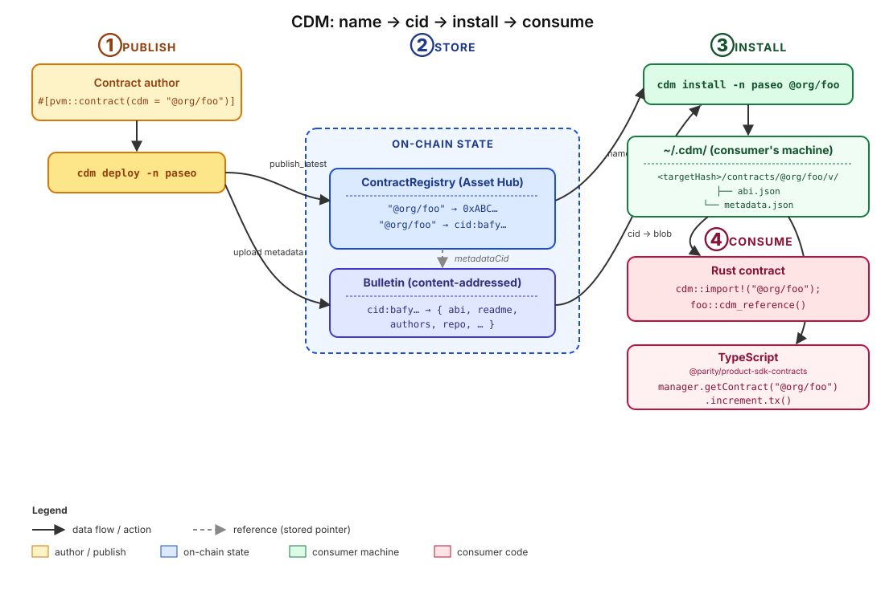
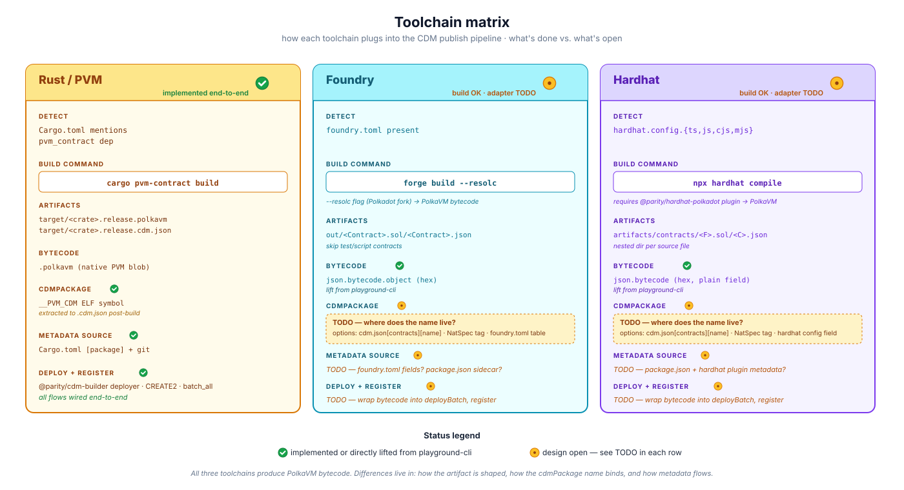
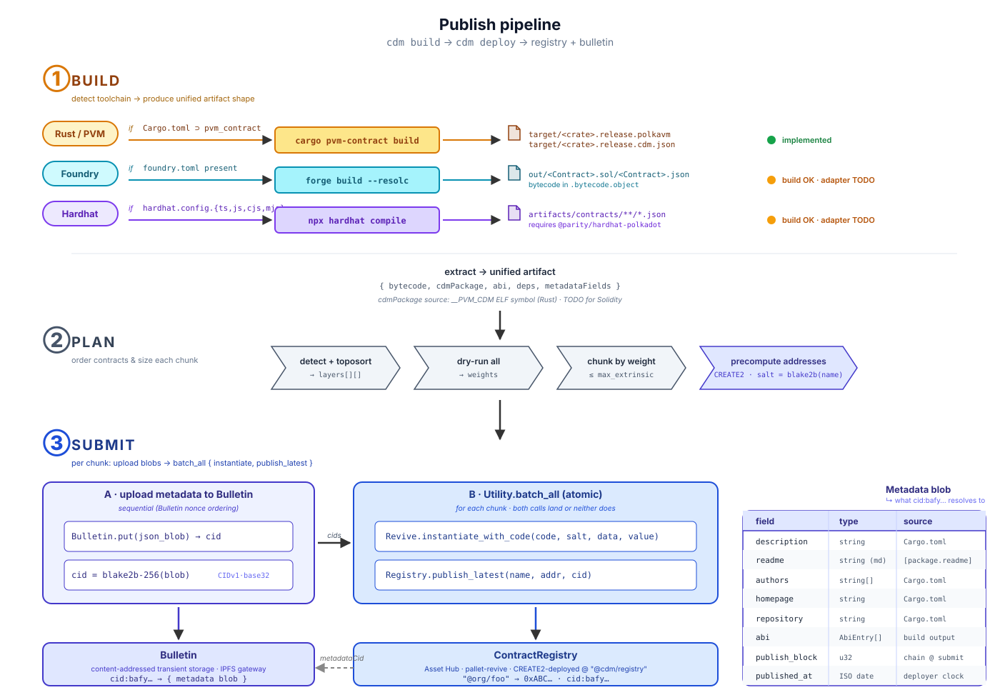
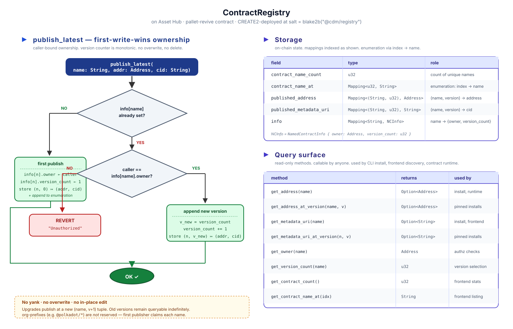
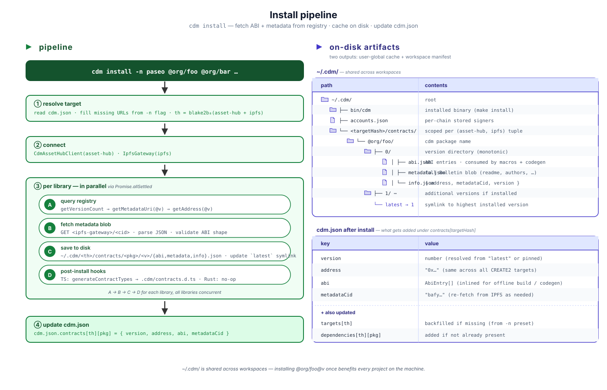

# CDM System

**Status**

- **Rust / PVM**: implemented end-to-end (build · deploy · publish metadata · register · install · consume).
- **Foundry / Hardhat**: first-pass build + deploy pipeline implemented. Solidity bytecode/ABI is normalized before deploy; `/// @custom:cdm @org/name` supplies the registry package name.
- **TypeScript SDK**: migrating from `@parity/cdm-codegen` to `@parity/product-sdk-contracts` (targets `pallet-revive` directly, not Ink). Old SDK to be deprecated once parity is reached.

## System map



A CDM package name is a globally unique identifier resolved by an on-chain registry. Rust contracts declare it in Cargo metadata (`[package.metadata.cdm] package = "@org/name"`); Solidity contracts declare it with `/// @custom:cdm @org/name`. Contracts publish `(name → address, name → metadataCid)` on Asset Hub; metadata blobs live on Bulletin (content-addressed, retrievable via IPFS gateway). Consumers install a frozen snapshot of `(ABI, address, version)` into `cdm.json` plus generated project `.cdm/` artifacts, after which Rust contracts use `cdm::import!()` and TypeScript apps use `@parity/product-sdk-contracts`.

## Toolchain matrix



All three toolchains produce PolkaVM bytecode (Solidity via `resolc`, Rust via `cargo pvm-contract build`). Each toolchain adapter is allowed to know its own build output shape. The adapter output is normalized into a CDM build record containing the package name, bytecode path, ABI/artifact path, source path, toolchain, and display metadata. Deploy consumes those records uniformly; it should not branch on Rust vs Foundry vs Hardhat once build output has been normalized.

Current Solidity conventions:

- **`cdmPackage` source** — NatSpec immediately before the concrete contract declaration: `/// @custom:cdm @org/name`.
- **Artifact lookup** — Foundry uses `forge config --json` for `out`; Hardhat uses configured `paths.artifacts` when statically readable, then validates artifacts by shape. Artifacts are matched to detected contracts by source file + Solidity contract name, not by contract name alone.
- **Metadata source** — first pass uses project-level `package.json`, root README, and git remote. More precise per-contract metadata conventions are still open.
- **Deploy + register** — all package-bearing contracts publish metadata to Bulletin and call `Registry.publish_latest(...)` in the same deploy/register flow.

## Publish pipeline



Three stages:

- **① BUILD** — detect toolchain from workspace markers; invoke its native build; normalize the output into a unified internal shape `{ bytecode, cdmPackage, version, abi, deps, metadataFields }`. Cargo metadata gives Rust package identity, the semver version (`[package] version`), and local dependency edges directly.
- **② PLAN** — `detect + toposort` produces deployment layers; contracts whose Cargo version is not greater than the registry's latest published key are skipped as up-to-date (publishing is idempotent); each remaining contract is dry-run for weight; contracts are greedy-packed into chunks fitting `System.BlockWeights.normal.max_extrinsic`; CREATE2 addresses are pre-computed.
- **③ SUBMIT** — per chunk: first upload metadata blobs to Bulletin (sequential per Bulletin's nonce ordering, returns CIDs), then a single `Utility.batch_all` atomically issues `Revive.instantiate_with_code` (the version's implementation contract) and `Registry.publish(name, versionKey, addr, cid)`. On a name's first publish the registry also CREATE2-instantiates the name's proxy inside the same call. Atomic within a chunk; chunks across are non-atomic by design.

CREATE2 salts:

```
implSalt   = blake2b-256(JSON.stringify([registry, cdmPackage, semver]))
implAddr   = create2_address(deployer, implSalt, keccak256(bytecode))
proxySalt  = keccak256(cdmPackage)                     # derived on-chain by the registry
proxyAddr  = create2_address(registry, proxySalt, keccak256(proxyBlob))
```

Implementation addresses are per-version throwaways; the proxy address is the name's permanent address, a pure function of `(registry, name, frozen proxy blob)` — predictable offline, identical on every chain that runs the same registry address and proxy-blob generation. The registry itself is the special CREATE3 case, deployed under the package-only salt `blake2b-256("@cdm/registry.2")`.

The metadata blob composition is in the right panel of the publish-pipeline diagram. Two non-obvious fields: `publish_block` is set to Asset Hub's head at submit time; `published_at` is the deployer's wall clock at submit time.

## ContractRegistry



The registry is a `pallet-revive` contract on Asset Hub, CREATE2-deployed under `@cdm/registry.2`. It is split into an EIP-1967 proxy (the stable registry address, supporting admin `setCode` upgrades and `freeze`) and a delegate-called implementation contract that holds the logic. Registry addresses are environment-scoped and resolved through `@parity/cdm-env` (`getRegistryAddress(name)`, defaulting to Paseo); custom environments can still pass `--registry-address`. `cdm.json.registry` records the registry used for the installed snapshot.

Beyond its catalog role the registry is a **factory**: the first publish of a name CREATE2-instantiates that name's proxy (`contract-proxy`, a frozen blob whose code hash the registry stores), which permanently owns the name's address, storage, and balance. Versions are implementation contracts the proxy delegate-calls, so every version runs against the same state and the name's address never changes again. The proxy reserves no selectors — plain calls pass through to the latest implementation untouched; a `[magic][versionKey]` calldata prefix routes to an exact version; and a `[magic][0][selector]` meta plane serves CDM queries and the registry-only admin operations (`publish`, `setMinSupported`, `setAdmin`). Names registered before this model ("legacy") have no proxy: they resolve to their latest standalone contract exactly as before, and their first new publish upgrades them onto a proxy (with fresh state — old deployments are not proxies and cannot be retrofitted).

Key invariants:

- **First-write-wins ownership.** First publisher of a name becomes its owner. Subsequent calls revert unless `caller == info[name].owner`.
- **Monotonic semver.** Versions are semver triples packed as `major<<64 | minor<<32 | patch` (u128). No overwrite, no delete, no yank: every publish must be strictly greater than the last, so the version list is append-only sorted and binary-searchable. Legacy version indices derive as `0.0.(index+1)`. Old versions remain queryable — and, behind a proxy, callable — indefinitely.
- **Min-supported ratchet.** A name's owner can raise (never lower) a floor version; versioned calls below it revert `UnsupportedVersion` at the proxy. This is the explicit storage-migration escape hatch: when a new version reshapes state incompatibly, stale pinned consumers get a precise error instead of silent corruption. Plain (latest) calls are unaffected.
- **Org prefixes are not reserved.** Anyone can claim `@polkadot/foo` if no one else has. Org-level access control (e.g., OpenGov-owned `@polkadot/*`) is an open design question.

The Storage struct and query surface (`get_address`, `get_metadata_uri`, `get_owner`, `get_proxy`, `get_latest_key`, `get_min_supported`, `get_version_count`, `get_version_at`, `get_contract_count`, enumeration via `get_contract_name_at`, plus legacy `_at_version` variants) are in the right pane of the diagram.

## Install pipeline



`cdm install` reads flat package dependencies from `cdm.json`, resolves the target environment from CLI input (`-n <preset>` or explicit URLs/address), then in parallel per library:

1. **Resolve version** — the requested spec (`latest`, exact `1.2.3`, or a range like `^1.2`) resolves against the registry's version list (`getVersionCount` + `getVersionAt`, npm-style `maxSatisfying` for ranges) to one exact published version. Numeric pins from pre-semver cdm.json files resolve as legacy indices.
2. **Fetch metadata** — `GET <ipfs-gateway>/<cid>` → parse JSON → validate ABI shape.
3. **Save artifacts** — write `{abi, metadata, info}.json` under project `.cdm/contracts/<pkg>/<semver>/` and update the `latest` symlink.
4. **Post-install hooks** — TypeScript: `generateContractTypes` writes `.cdm/contracts.d.ts`. Rust: `cdm::import!()` reads the ABI embedded in `cdm.json` and can materialize the project-local ABI artifact needed by `abi_import!`.

Finally `cdm.json.contracts[pkg]` is updated with `{ version: "1.2.3", address, abi, metadataCid }` — `address` is the name's stable address (`getAddress`), so it survives future publishes — and `cdm.json.registry` records the registry address used by install. The inlined ABI makes builds reproducible and browser-importable; the pinned version pins against future `latest` drift (today `cdm::import!` still calls latest at runtime; calldata-prefix pinning for Rust consumers lands when the upstream SDK grows a call preamble). Account data remains under user-level CDM state, but installed contract artifacts are project-local.

## Consumption

Address resolution happens **at runtime** for Rust contracts (registry call from inside the contract) and **at install time** for TypeScript (baked into `cdm.json.contracts`).

### Rust contract

```rust
cdm::import!("@org/foo");

#[pvm_contract_sdk::contract(allocator = "pico", allocator_size = 1024)]
mod forum {
    use super::*;

    pub struct Forum;

    impl Forum {
        #[pvm_contract_sdk::method]
        pub fn call_foo(&self) {
            // Resolves @org/foo's address via Registry.get_address at runtime.
            let f = foo::Foo::cdm_lookup();
            f.do_something().call(self).expect("call failed");
        }
    }
}
```

The `cdm::import!()` proc-macro first checks Cargo metadata for a local workspace member with matching `[package.metadata.cdm] package`, and otherwise reads installed ABI data from the flat `cdm.json` at compile time. `cdm_lookup()` performs the registry read at runtime.

### TypeScript app

Use `@parity/product-sdk-contracts` (replaces `@parity/cdm-codegen`):

```ts
import { createChainClient } from "@parity/product-sdk-chain-client";
import { paseo_asset_hub } from "@parity/product-sdk-descriptors/paseo-asset-hub";
import { ContractManager } from "@parity/product-sdk-contracts";
import { SignerManager } from "@parity/product-sdk-signer";
import cdmJson from "./cdm.json";

const client = await createChainClient({
    chains: { assetHub: paseo_asset_hub },
    rpcs:   { assetHub: ["wss://paseo-asset-hub-next-rpc.polkadot.io"] },
});

const signerManager = new SignerManager();
await signerManager.connect();

const manager = ContractManager.fromClient(
    cdmJson, client.raw.assetHub, paseo_asset_hub, { signerManager },
);

const counter = manager.getContract("@org/counter");

// Read (dry-run, no tx)
const { value } = await counter.getCount.query();

// Write (signed tx; uses signerManager's current account, falls back to defaultSigner)
await counter.increment.tx();

// Batchable form (combine with non-contract Asset Hub calls via batchSubmitAndWatch)
const prepared = counter.increment.prepare();
```

Material differences from `@parity/cdm-codegen`:

- Targets `pallet-revive` directly (not Ink) — wholesale replacement, not an upgrade.
- Consumer owns the chain client; the SDK wraps it (rather than constructing one internally).
- `SignerManager` enables dynamic account switching; static `defaultSigner` is a fallback for queries.
- `.prepare()` enables batching with other Asset Hub extrinsics.
- Named error classes: `ContractNotFoundError`, `ContractSignerMissingError`, `ContractDryRunFailedError`.

Build-time codegen (Node-only) — emits typed module augmentation for `manager.getContract(...)`:

```ts
import { generateContractTypes, resolveContractTypeInputs } from "@parity/product-sdk-contracts/codegen";
import { writeFileSync } from "node:fs";

const resolved = await resolveContractTypeInputs([
    { library: "@org/counter", abiPath: "./target/counter.release.abi.json" },
]);
writeFileSync(".cdm/contracts.d.ts", generateContractTypes(resolved));
```

## Implementation references

**Current CDM (this repo):**

- `src/apps/cli/src/commands/{build,deploy,install/index}.ts`
- `src/apps/cli/src/lib/{install-pipeline,deploy-pipeline}.ts`
- `src/lib/contracts/src/{detection,builder,pipeline,deployer,publisher,store,cdm-json,cdm-local-json}.ts`
- `src/lib/cdm/rust-macros/src/lib.rs` — `cdm::import!()` proc-macro
- `src/contract/src/main.rs` — ContractRegistry on-chain contract

**New TypeScript SDK (separate repo, replaces `@parity/cdm-codegen`):**

- `/Users/charleshetterich/code/product-sdk/product-sdk/packages/contracts/src/manager.ts` — `ContractManager`
- `/Users/charleshetterich/code/product-sdk/product-sdk/packages/contracts/src/codegen.ts` — `generateContractTypes`
- `/Users/charleshetterich/code/product-sdk/product-sdk/packages/contracts/README.md` — full API reference

**Solidity build adapters (to lift into `@parity/cdm-builder`):**

- `/Users/charleshetterich/code/playground-cli/src/utils/build/detect.ts` — file-based toolchain detection
- `/Users/charleshetterich/code/playground-cli/src/utils/deploy/contracts.ts` — `compileFoundry`, `compileHardhat`, `extractFoundryBytecode`, `extractHardhatBytecode`, `hexToBytes`, `writeTmpBytecode`
